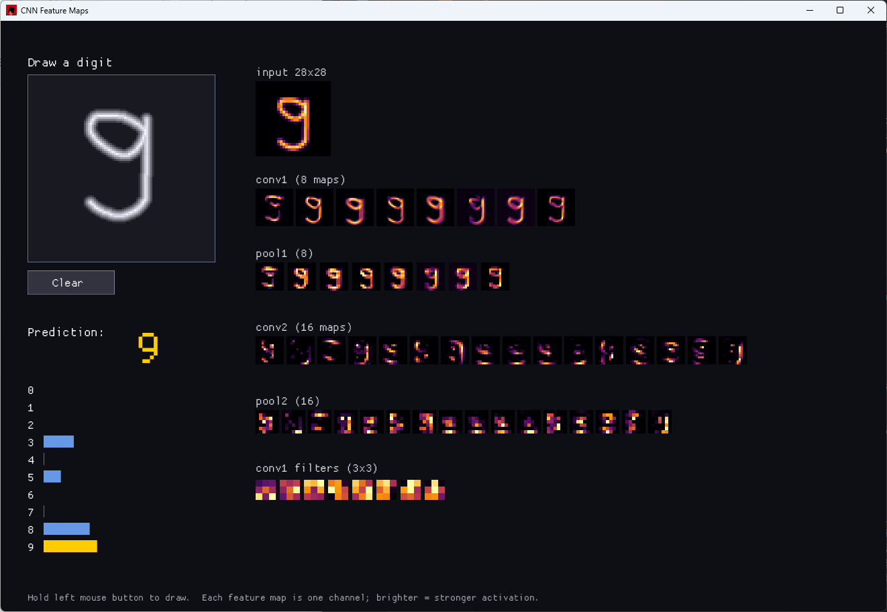

# CNN Feature Maps (Rust)

Draw a digit with the mouse and watch a convolutional neural network recognize it,
with **every feature map shown live**. As you draw, you see the input, the activations
of both convolutional layers and both pooling layers, the learned 3×3 filters, and the
output probabilities update in real time.

The network — convolutions, max-pooling, fully-connected layers, ReLU, softmax,
**backpropagation and training** — is written from scratch in a dependency-free crate
and is fully unit-tested (including a numerical gradient check). It trains on MNIST and
reaches about **98% test accuracy**. Rendering is done with
[macroquad](https://macroquad.rs).

## Screenshot


## Architecture

```
input 1x28x28
  -> conv 3x3, 8 filters  -> ReLU -> maxpool 2x2   (8 x 14x14)
  -> conv 3x3, 16 filters -> ReLU -> maxpool 2x2   (16 x 7x7)
  -> flatten -> dense 64 -> ReLU
  -> dense 10 -> softmax
```

Trained with mini-batch SGD and cross-entropy.

## Requirements

- A recent stable Rust toolchain (Rust ≥ 1.80 recommended).
- A GPU with OpenGL (macroquad). On **Linux** you may also need:
  `sudo apt install libx11-dev libxi-dev libgl1-mesa-dev libasound2-dev`.

## Getting MNIST

The training code reads the four gzipped IDX files from a `data/` folder. Download them
once (they come from a public mirror):

```
mkdir -p data && cd data
curl -LO https://raw.githubusercontent.com/fgnt/mnist/master/train-images-idx3-ubyte.gz
curl -LO https://raw.githubusercontent.com/fgnt/mnist/master/train-labels-idx1-ubyte.gz
curl -LO https://raw.githubusercontent.com/fgnt/mnist/master/t10k-images-idx3-ubyte.gz
curl -LO https://raw.githubusercontent.com/fgnt/mnist/master/t10k-labels-idx1-ubyte.gz
cd ..
```

`curl` ships with Windows 10+, macOS and Linux.

## Run

```
cargo run --release
```

On the first launch, if `cnn_weights.bin` is not present, the app trains the network in
the background (about a minute or two) while showing progress, then caches the weights.
On later launches it loads the cache instantly. After it is ready, draw a digit in the
left panel and watch the feature maps light up.

If you prefer to train ahead of time (and see per-epoch test accuracy in the terminal):

```
cargo run -p cnn_core --release --example train
# optional: cargo run -p cnn_core --release --example train -- data 30000 6
# args: <data-dir> <train-images> <epochs>
```

This writes `cnn_weights.bin`, which the app then loads.

## Tests

```
cargo test -p cnn_core
```

What is covered:

- A **numerical gradient check** comparing analytic backprop to finite differences. The
  smooth head (dense → softmax → cross-entropy) is checked to a tight tolerance; the
  layers behind ReLU are checked statistically by median error to tolerate the expected
  kink artifacts of finite differences.
- Max-pooling forward/backward (argmax routing), softmax, forward shapes, and a
  weight save/load round-trip.

## How the visualization works

Each feature map is one channel of a layer's activation, drawn as a small heatmap
(brighter = stronger activation) with an inferno-style colormap. The drawn digit goes
through the same preprocessing as the training data (crop to bounding box, scale into a
20×20 box, center by center of mass into 28×28), so what the network sees matches what
it learned.

## Layout

```
cnn-digit-viz/
├─ core/                  # no rendering, fully unit-tested
│  ├─ src/tensor.rs       # Vol (C×H×W tensor), PRNG
│  ├─ src/layers.rs       # Conv, MaxPool, Dense, ReLU, softmax (fwd + bwd)
│  ├─ src/cnn.rs          # the model: forward, backprop, train, save/load
│  ├─ src/mnist.rs        # gz IDX loader + drawn-digit preprocessing
│  └─ examples/train.rs   # headless training, prints accuracy, saves weights
└─ app/                   # macroquad UI (the binary)
   └─ src/main.rs
```

